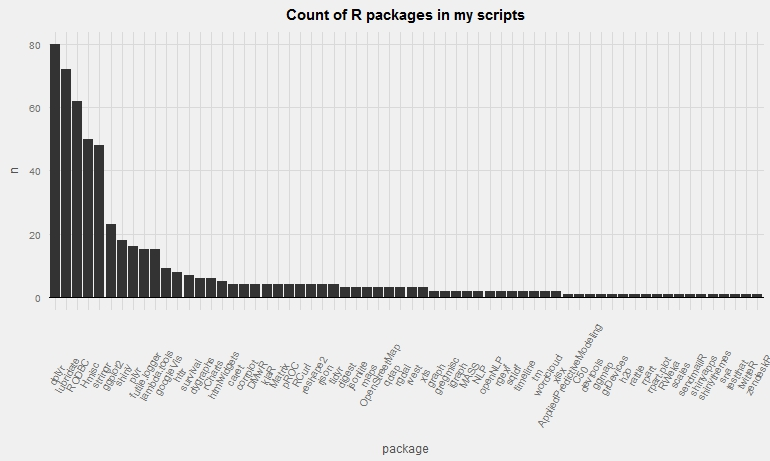

## Who I am

My background:

* Statistician by education
* Wannabe hacker
* Have used R on a daily basis for the last three years

 

Job:

* Currently I'm a Data Scientist at [VG (Verdens Gang)](http:\\vg.no)

## So what I do

**I'm the only Data Scientist at VG and I'm working with data from our logged in users and our digital products**

 

* I'm creating insights about our users and our digital products
    + better user experience
    + product development
    + generating more revenue

## How I use R

 

* **I use RStudio locally on my windows machine**

* **Or on a Linux server from RStudio Server that provide a web based RStudio UI**

* **Have a very basic automated workflow consisting of cron jobs and logging that decide what scripts to run when**   _(more on that later)_

## The work process (and how R fits in)

 

* **getting/connection to data**
   

* **transforming data**
   

* **analysis and modeling on the transformed data**
   

* **visualization and communication**

## Getting the data

**First we need data and to get that we need to connect to different data sources**

> * Flat files (_base_, _data.table_, _xlsx_)
> * RDBMS/MySQL (_RODBC_)
> * HDFS/Hive (_RODBC_, _RHive_)
> * API's (_httr_, _jsonlite_, _XML_)
> * Web crawling (_rvest_)

## Transforming/Munging/Wrangling data 

**"Data Scientist spend 60-80% of their time on 'data munging' or 'data wrangling'"**

* _dplyr_ (pipes %>% from magritter)
* _data.table_
* _tidyr_
* _lubridate_
* _stringr_

 

> The transformed/validated/enriched data is populating different databases that is connected to dashboards, and used for ad hoc analysis and prediction models

## My Automatic R workflow

I have multiple scripts that is automatic executed on a server that have dependencies between them

 

My hacker solution includes a lot of logging both to files and data bases

* _futile.logger_ (similar to Apache log4j)
* _lambda.tools_ (github version)

## Modeling the data

**This is a smaller but very importent part where I use the pre-processed data**

 

* Predict which users that are going to stop using our product
    + why are they stopping
* Segmenting the users
* Survival analysis
* Finding the articles our users are most interested in

## Modeling the data

**There is a lot of different R packages to use here!**

 

Some of the packages I have used the most are:

* _caret_
* _h2o_
* _RWeka_
* _rattle_

## Visualization and Communication

**Very important to be able to visualise the data and results of the analysis**

Visualizations packages

* _ggplot2_
* _rCharts_
* _htmlwidgets_
* _googleVis_
* _ggvis_

A lot of interesting JavaScript visualizing is happening in R right now

## Visualization and Communication

**Communicate the results and insights are just as importent**

 

* _shiny_
 

* _rmarkdown_

## Why I use R in one line

   

_No other programming language can connect to any data source, easily transform, use whatever statistical/ML model, do awesome visualization and then share the results in an online app or interactive document in fewer lines that R._

## Some R fun

Number of packages in my scripts

# Thanks!

